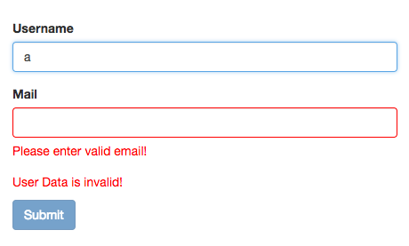

## Angular Forms: Grouping Form Controls
- to create a subgroup with your form:
  - add `ngModelGroup` directive to your form's div and assign it a name for the subgroup's key.
    - for example, the below snippet's subgroup name is "userData"

  - can export the directive into a local template variable using `#mySubGroupName=ngModelGroup`

    ```
      <form 
        (ngSubmit)="onSubmit()" 
        #userNameForm="ngForm">
        
        <div
            id="user-data"
            ngModelGroup="userData"
            #userData="ngModelGroup"
        >
    
        <div class="form-group">
          <label for="username">Username</label>
          <input
                type="text"
                id="username"
                class="form-control"
                ngModel
                name="username"
                required
          >
        </div>
        <div class="form-group">
            <label for="email">Mail</label>
            <input
                  type="email"
                  id="email"
                  class="form-control"
                  ngModel
                  name="email"
                  required
                  #email="ngModel"
            >
            <span class="help-block" *ngIf="!email.valid && email.touched">Please enter valid email!</span>
        </div>
      </div>

      <p
        class="help-block"
        *ngIf="!userData.valid && userData.touched">
        User Data is invalid!
      </p>

      </form>
    ```


  - The above code generates this: 



## Radio Buttons

- **app.component.html**
```
  <p>Please select your pronoun </p>
    <div class="radio" *ngFor="let pronoun of pronouns">
      <label>
        <input
          type="radio"
          name="pronoun"
          ng-model
          [value]="pronoun"
          required
        >
        {{ pronoun }}
      </label>
    </div>
```

- **app.component.ts**
  ```
    export class AppComponent {
      public genders: String[] = ["male", "female", "non-binary"]
    };
  ```


- The above code generates this: 


