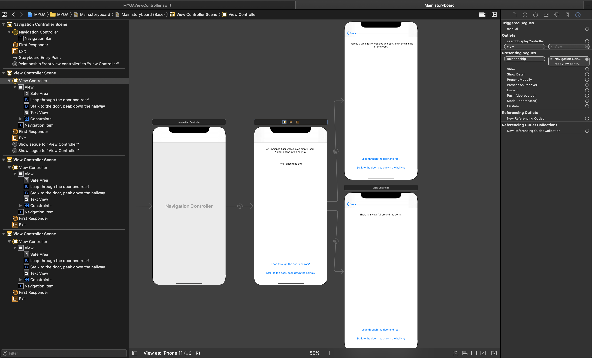

### How to Create a Collection View via Storyboards

1. Add a `UICollectionViewController` into the storyboard from the object library. 
1. Add the Custom Class for the View Controller
1. Customize the `CollectionViewCell`
    1. If you're creating a custom `UICollectionViewCell`, add the class name to the Custom Class section in Interface Builder
    1. Add the Restore Identifier

In order to customize the spacing and layout of the cells `UICollectionViewFlowLayout` to your Collection View: 
1. Add a `UICollectionViewFlowLayout` to the `UICollectionViewController` via `@IBOutlet`
    `@IBOutlet weak var flowLayout: UICollectionViewFlowLayout!`
1. Connect the `flowLayout` outlet to the flowLayout representation in Storyboard (marked with a yellow cube)
1. Style the collection view layout by setting the minimumLineSpacing, minimumInteritemSpacing, and itemSize properties

    import UIKit

    // MARK: - CatCollectionViewCell: UICollectionViewCell

    class CatCollectionViewCell: UICollectionViewCell {
        
        // MARK: Outlets
        
        @IBOutlet weak var imageView: UIImageView!
        @IBOutlet weak var nameLabel: UILabel!
    }

    import Foundation
    import UIKit

    // MARK: - CollectionViewController: UICollectionViewController

    class CollectionViewController: UICollectionViewController {

        // MARK: Properties
        
        // TODO: Add outlet to flowLayout here.
        @IBOutlet weak var flowLayout: UICollectionViewFlowLayout!
        
        // This is an array of Cats
        let cats = [Cat(name: "Sophie", color: .gray), Cat(name: "Donnie", color: .black), Cat(name: "Angela", color: .white)]
        
        // MARK: Life Cycle
        
        override func viewDidLoad() {
            super.viewDidLoad()
            //TODO: Implement flowLayout here.
        }

        override func viewWillAppear(_ animated: Bool) {
            super.viewWillAppear(animated)
        }
    
        // MARK: Collection View Data Source
        
        override func collectionView(_ collectionView: UICollectionView, numberOfItemsInSection section: Int) -> Int {
            return cats.count
        }
        
        override func collectionView(_ collectionView: UICollectionView, cellForItemAt indexPath: IndexPath) -> UICollectionViewCell {
            
            let cell = collectionView.dequeueReusableCell(withReuseIdentifier: "CollectionViewCell", for: indexPath) as! CatCollectionViewCell
            let cat = self.cats[(indexPath as NSIndexPath).row]
            
            // Set the name and image
            cell.nameLabel.text = cat.name
            cell.imageView?.image = UIImage(named: cat.imageName)

            return cell
        }
        
        override func collectionView(_ collectionView: UICollectionView, didSelectItemAt indexPath:IndexPath) {
            
            let detailController = self.storyboard!.instantiateViewController(withIdentifier: "CatDetailViewController") as! CatDetailViewController
            detailController.cat = cats[(indexPath as NSIndexPath).row]
            self.navigationController!.pushViewController(detailController, animated: true)

        }
    }

    
    

